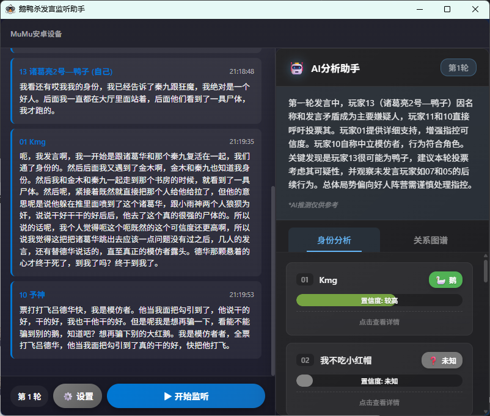

# 🎮 GGD-AI | 鹅鸭杀AI发言助手

<p align="center">
  
  
  
  
  
  
</p>

<p align="center">
  <b>智能识别游戏发言 | 实时语音转文字 | 玩家自动追踪 | AI身份推理</b>
</p>

<p align="center">
  
  
</p>

---

## 📸 应用截图

<p align="center">
  
</p>

<p align="center">
  <i>主界面展示：左侧实时显示玩家发言记录，右侧AI分析助手智能推理玩家身份关系</i>
</p>

### 界面功能说明

| 区域 | 功能描述 |
|------|----------|
| 📜 **发言记录区** | 按轮次分组展示所有玩家发言，带时间戳和发言时长 |
| 🤖 **AI分析助手** | 基于大模型智能推理玩家身份（鹅/鸭/中立）和置信度 |
| 👥 **身份分析** | 展示每位玩家的身份推测、推理依据、可疑点/可信点 |
| 🕸️ **关系图谱** | 可视化展示玩家间的盟友/敌对/怀疑关系 |
| 🎮 **控制面板** | 开始/结束监听、切换轮次、刷新玩家信息 |

---

## 📖 项目简介

**GGD-AI** 是一款专为《鹅鸭杀》(Goose Goose Duck) 设计的智能发言辅助工具。通过计算机视觉和语音识别技术，自动识别游戏中正在发言的玩家，并将语音实时转换为文字，同时利用AI大模型分析玩家发言，推理身份关系，帮助玩家更好地记录和分析游戏对话。

### ✨ 核心功能

| 功能 | 描述 |
|------|------|
| 🔍 **智能画面识别** | 基于OpenCV模板匹配 + OCR，实时检测发言玩家标识 |
| 🎙️ **实时语音识别** | 使用FunASR模型，中文识别准确率高 |
| 📝 **自动文字记录** | 发言内容自动转录并按玩家分类存储 |
| 🤖 **AI身份推理** | 基于LangGraph + OpenAI，分析发言推理玩家身份 |
| 🕸️ **关系图谱分析** | 智能推断玩家间的盟友/敌对关系 |
| 🖥️ **窗口捕获** | 支持后台窗口截图，无需前置游戏 |
| 🔄 **轮数管理** | 支持多轮游戏记录，数据分轮次展示 |
| 📊 **可视化界面** | Fluent Design风格UI，毛玻璃效果 |

---

## 🛠️ 技术栈

### 后端技术
```
┌─────────────────────────────────────────────────────────┐
│  Python 3.12                                            │
│  ├── FastAPI          - REST API & WebSocket           │
│  ├── FunASR           - 中文语音识别 (Paraformer-zh)    │
│  ├── OpenCV           - 图像处理与模板匹配              │
│  ├── PaddleOCR        - OCR文字识别                    │
│  ├── LangGraph        - AI推理工作流编排               │
│  ├── OpenAI           - 大模型API调用                  │
│  ├── PyAudio          - 音频流捕获                    │
│  ├── PyWin32          - Windows API 窗口操作          │
│  └── NumPy            - 数值计算                      │
└─────────────────────────────────────────────────────────┘
```

### 前端技术
```
┌─────────────────────────────────────────────────────────┐
│  Tauri + React 18                                       │
│  ├── TypeScript       - 类型安全                       │
│  ├── Vite             - 构建工具                       │
│  ├── Fluent Design    - 微软风格UI                     │
│  └── WebSocket Client - 实时通信                       │
└─────────────────────────────────────────────────────────┘
```

---

## 🎯 实现原理

### 系统架构图

```
┌─────────────────────────────────────────────────────────────────────────────┐
│                              GGD-AI 系统架构                                 │
└─────────────────────────────────────────────────────────────────────────────┘

┌──────────────┐      ┌──────────────────────────────────────┐      ┌──────────────┐
│   鹅鸭杀      │      │           Python 后端服务             │      │   Tauri桌面   │
│   游戏窗口    │──────▶│                                      │◀─────▶│   前端界面    │
└──────────────┘      └──────────────────┬───────────────────┘      └──────────────┘
                                          │
           ┌──────────────────────────────┼──────────────────────────────┐
           │                              │                              │
           ▼                              ▼                              ▼
    ┌──────────────┐              ┌──────────────┐              ┌──────────────┐
    │  屏幕捕获模块 │              │  语音处理模块 │              │  AI分析模块   │
    │              │              │              │              │              │
    │ ┌──────────┐ │              │ ┌──────────┐ │              │ ┌──────────┐ │
    │ │Win32 API │ │              │ │PyAudio   │ │              │ │LangGraph │ │
    │ │窗口截图  │ │              │ │音频捕获  │ │              │ │工作流编排│ │
    │ └──────────┘ │              │ └──────────┘ │              │ └──────────┘ │
    │ ┌──────────┐ │              │ ┌──────────┐ │              │ ┌──────────┐ │
    │ │OpenCV   │ │              │ │FunASR    │ │              │ │OpenAI    │ │
    │ │模板匹配  │ │              │ │语音识别  │ │              │ │身份推理  │ │
    │ └──────────┘ │              │ └──────────┘ │              │ └──────────┘ │
    │ ┌──────────┐ │              │ ┌──────────┐ │              │ ┌──────────┐ │
    │ │PaddleOCR│ │              │ │VAD检测   │ │              │ │关系分析  │ │
    │ │玩家ID识别│ │              │ │语音分割  │ │              │ │置信度计算│ │
    │ └──────────┘ │              │ └──────────┘ │              │ └──────────┘ │
    └──────────────┘              └──────────────┘              └──────────────┘
```

### 数据流转图

```
┌─────────────────────────────────────────────────────────────────────────────┐
│                              核心数据流转                                     │
└─────────────────────────────────────────────────────────────────────────────┘

    游戏画面          发言玩家         音频流           转录文本          AI分析
      │                │               │                │               │
      ▼                ▼               ▼                ▼               ▼
┌──────────┐     ┌──────────┐    ┌──────────┐    ┌──────────┐    ┌──────────┐
│ 屏幕捕获  │────▶│ 玩家ID   │    │ 音频捕获  │───▶│ 语音识别  │───▶│ 身份推理  │
│ 0.5s/次  │     │ 检测     │    │ VAD分割  │    │ FunASR   │    │ LangGraph│
└──────────┘     └──────────┘    └──────────┘    └──────────┘    └──────────┘
                       │                              │               │
                       │         ┌───────────────────┘               │
                       │         │                                     │
                       ▼         ▼                                     ▼
                ┌──────────┐ ┌──────────┐                      ┌──────────┐
                │ 当前发言  │◀│ 关联发言  │                      │ 关系图谱  │
                │ 玩家ID   │ │ 记录    │                      │ 生成     │
                └──────────┘ └──────────┘                      └──────────┘
                       │              │                               │
                       └──────────────┼───────────────────────────────┘
                                      │
                                      ▼
                               ┌──────────┐
                               │ WebSocket │
                               │ 实时推送  │
                               └──────────┘
                                      │
                                      ▼
                               ┌──────────┐
                               │ React前端 │
                               │ 实时展示  │
                               └──────────┘
```

### 核心流程

1. **窗口选择** 📋
   - 使用Tkinter GUI展示所有可见窗口
   - 支持双击高亮确认目标窗口
   - 通过Win32 API获取窗口句柄

2. **画面监控** 🖼️
   - 每0.5秒捕获游戏画面（PrintWindow API支持后台）
   - OTSU二值化 + 连通域分析提取发言卡片区域
   - 在卡片顶部区域进行模板匹配识别玩家编号（01-13）
   - 同时支持PaddleOCR识别玩家名称

3. **音频捕获** 🎧
   - 捕获VB-Cable虚拟声卡输出
   - VAD语音活动检测，过滤静音
   - 累积音频缓冲直到玩家切换
   - 新玩家发言时触发上一段语音的识别

4. **语音识别** 🗣️
   - FunASR模型：Paraformer-zh + FSMN-VAD + CT-Punc
   - 支持中文标点自动恢复
   - 实时转录并关联当前发言玩家
   - 支持情感分析（简单极性分析）

5. **AI推理分析** 🧠
   - 使用LangGraph构建分析工作流
   - 基于OpenAI GPT模型推理玩家身份
   - 分析发言内容生成可疑点/可信点
   - 推断玩家间的关系（盟友/敌对/怀疑）

6. **数据同步** 🔄
   - WebSocket实时推送新记录到前端
   - 自动保存JSON格式游戏记录
   - 支持多轮次数据分离存储

---

## 💎 技术亮点

### 1. 双模态融合识别
```python
# 画面识别发言玩家 + 语音识别内容
def _on_digit_change(self, new_digit, old_digit):
    # 玩家切换时触发语音缓冲区识别
    if self.audio_analyzer:
        self.audio_analyzer.set_speaker(new_digit, self.current_round)
```
将**计算机视觉**与**语音识别**结合，实现"谁说了什么"的精准记录。

### 2. 模板匹配优化
```python
# 基于连通域特征的卡片定位
if (total_square * 0.01 < square < total_square * 0.02 and
    white_ratio > 0.7 and 2.0 < w / h < 3.0):
    # 在卡片顶部区域进行模板匹配
    card_top = img_gray[y:int(y + h*0.3), x:int(x + w*0.15)]
```
通过**几何特征预筛选** + **局部模板匹配**，实现高精度玩家标识识别。

### 3. LangGraph AI分析工作流
```python
# 使用LangGraph构建多步骤分析流程
workflow = StateGraph(AnalysisState)
workflow.add_node("prepare", prepare_analysis_node)
workflow.add_node("analyze", analyze_node)
workflow.add_node("finalize", finalize_node)
workflow.add_edge("prepare", "analyze")
workflow.add_edge("analyze", "finalize")
workflow.add_edge("finalize", END)
```
基于**LangGraph**构建可扩展的AI分析管道，支持复杂的推理工作流。

### 4. 模型预加载与复用
```python
# 只加载一次模型，避免重复启动开销
self._preloaded_model = await loop.run_in_executor(None, self._load_model)
# 后续启动直接复用
result = await loop.run_in_executor(
    None,
    lambda: self.monitor.start(preloaded_model=self._preloaded_model)
)
```
通过**模型预加载**机制，将启动时间从数十秒缩短到秒级。

### 5. 线程安全设计
```python
# 多线程环境下的事件队列
async def process_events():
    while True:
        while not event_queue.empty():
            event = event_queue.get_nowait()
            await manager.broadcast(event)
        await asyncio.sleep(0.1)
```
使用**异步事件队列**实现同步回调与异步WebSocket的无缝对接。

### 6. Fluent Design UI
```css
/* 毛玻璃效果 */
.acrylic-card {
  background: rgba(255, 255, 255, 0.08);
  backdrop-filter: blur(20px) saturate(180%);
  border: 1px solid rgba(255, 255, 255, 0.1);
}
```
采用微软**Fluent Design System**设计语言，呈现现代感的视觉效果。

---

## 🚀 快速开始

### 环境要求
- Windows 10/11
- Python 3.12 (conda环境)
- VB-Cable虚拟声卡
- Node.js 18+
- Rust 1.70+
- OpenAI API Key

### 安装步骤

```bash
# 1. 克隆仓库
git clone https://github.com/yourusername/GGD-AI.git
cd GGD-AI

# 2. 创建Python环境
conda create -n python3.12 python=3.12
conda activate python3.12

# 3. 安装Python依赖
pip install -r requirements.txt

# 4. 安装Node依赖
npm install

# 5. 配置环境变量
# 创建 .env 文件，添加 OpenAI API Key:
# OPENAI_API_KEY=your_api_key_here

# 6. 运行开发版本
npm run start
```

### 使用流程

1. **安装VB-Cable**：下载并安装 [VB-Cable](https://vb-audio.com/Cable/) 虚拟声卡
2. **设置音频输出**：将鹅鸭杀游戏音频输出设置为"CABLE Input"
3. **配置API Key**：在 `.env` 文件中设置你的 OpenAI API Key
4. **启动程序**：运行 `npm run start`
5. **选择窗口**：在弹出的窗口列表中选择鹅鸭杀游戏
6. **设置玩家ID**：输入你的游戏内编号（如01、02等）
7. **开始监听**：点击"开始监听"按钮
8. **查看AI分析**：停止监听后，AI将自动分析本轮发言

---

## 📁 项目结构

```
GGD-AI/
├── 📂 src/                           # Python后端核心
│   ├── main.py                       # 服务入口
│   ├── api_server.py                 # FastAPI服务 (WebSocket + REST API)
│   ├── monitor_controller.py         # 监控控制器
│   ├── ai_game_analyzer.py           # AI分析模块 (LangGraph)
│   ├── player_id_extractor.py        # 玩家ID提取
│   └── game_analysis.json            # 游戏记录数据
│
├── 📂 frontend/                      # 前端代码 (React + TypeScript)
│   ├── src/
│   │   ├── App.tsx                   # 应用主组件
│   │   ├── components/               # UI组件
│   │   │   ├── InitScreen.tsx        # 初始化界面
│   │   │   ├── SetupScreen.tsx       # 设置界面
│   │   │   ├── MainScreen.tsx        # 主监控界面
│   │   │   └── AIAnalysisPanel.tsx   # AI分析面板
│   │   ├── contexts/                 # React Context
│   │   │   └── MonitorContext.tsx    # 监控状态管理
│   │   ├── hooks/                    # 自定义Hooks
│   │   │   └── useMonitor.ts         # 监控Hook
│   │   ├── types/                    # TypeScript类型
│   │   │   └── analysis.ts           # AI分析相关类型
│   │   └── styles/                   # 样式文件
│   └── index.html
│
├── 📂 src-tauri/                     # Tauri桌面端框架
│   ├── Cargo.toml                    # Rust依赖配置
│   └── src/
│       ├── main.rs                   # 程序入口
│       └── lib.rs                    # 库文件
│
├── 📂 template_imgs/                 # 玩家数字模板 (01.png ~ 13.png)
│
├── 📂 imgs/                          # 截图和文档图片
│   └── QQ20260318-212452.png         # 应用截图
│
├── 📂 ffmpeg-8.0.1/                  # FFmpeg工具
│
├── 📄 main_monitor.py                # 游戏监控主控
├── 📄 screen_monitor.py              # 屏幕捕获模块
├── 📄 extract_speaker_num.py         # 发言玩家识别
├── 📄 extract_speaker_statement.py   # 语音分析模块
├── 📄 window_selector.py             # 窗口选择器
├── 📄 requirements.txt               # Python依赖
├── 📄 package.json                   # Node依赖
└── 📄 README.md                      # 项目说明
```

---

## 📊 数据示例

### 发言记录
```json
[
  {
    "timestamp": "12:15:09",
    "text": "来了兄弟，我在那边看了半天...",
    "emotion": "trust",
    "speaker": "11",
    "duration": 15.33,
    "round": 1
  },
  {
    "timestamp": "12:15:52",
    "text": "我开局遇到了赣州小丑...",
    "emotion": "trust",
    "speaker": "12",
    "duration": 34.6,
    "round": 1
  }
]
```

### AI分析结果
```json
{
  "round": 1,
  "timestamp": "2026-03-18T21:18:45",
  "playerAnalysis": [
    {
      "playerId": "13",
      "playerName": "诸葛亮2号",
      "identityGuess": "duck",
      "confidence": 0.85,
      "reasoning": "发言中多处矛盾，先声称看到尸体后又改变说法...",
      "suspiciousPoints": ["前后陈述矛盾", "过度解释不在场证明"],
      "trustworthyPoints": []
    }
  ],
  "relationshipMap": [
    {
      "from": "11",
      "to": "13",
      "type": "suspicious",
      "evidence": "玩家11直接指控玩家13，语气坚定..."
    }
  ],
  "summary": "第一轮发言中，玩家13因名称和发言矛盾成为主要嫌疑人..."
}
```

---

## 🛣️ 开发计划

- [x] 基础语音识别
- [x] 玩家标识检测
- [x] WebSocket实时通信
- [x] Fluent Design UI
- [x] AI智能推理分析 (LangGraph)
- [x] 玩家身份推理
- [x] 关系图谱生成
- [ ] 声纹识别区分玩家
- [ ] 游戏角色自动推断
- [ ] 历史数据统计分析
- [ ] 支持更多游戏模式

---

## 🤝 贡献指南

欢迎提交Issue和PR！

```bash
# 提交PR流程
1. Fork 本仓库
2. 创建特性分支 (git checkout -b feature/AmazingFeature)
3. 提交更改 (git commit -m 'Add some AmazingFeature')
4. 推送分支 (git push origin feature/AmazingFeature)
5. 创建 Pull Request
```

---

## 📜 开源协议

本项目基于 [MIT](LICENSE) 协议开源。

---

## 🙏 致谢

- [FunASR](https://github.com/alibaba-damo-academy/FunASR) - 阿里巴巴开源语音识别工具包
- [Tauri](https://tauri.app/) - 跨平台桌面应用框架
- [FastAPI](https://fastapi.tiangolo.com/) - 现代Python Web框架
- [LangGraph](https://github.com/langchain-ai/langgraph) - LangChain工作流编排框架
- [PaddleOCR](https://github.com/PaddlePaddle/PaddleOCR) - 百度开源OCR工具

---

<p align="center">
  Made with ❤️ by LRL
</p>

---

## ⚠️ 免责声明

### 版权声明
- **鹅鸭杀 (Goose Goose Duck)** 是 [Gaggle Studios, Inc.](https://gaggle.fun/) 的注册商标和版权所有内容
- 本项目展示的游戏截图仅用于功能演示目的
- 本项目不包含任何游戏本体文件或游戏资源
- **应用图标声明**：本应用使用的图标素材来源于网络，若涉及侵犯 Gaggle Studios 或相关权利方的知识产权，请联系删除。请联系项目维护者，我们将立即下架并更换图标

### 非官方声明
- 本项目是**第三方开源工具**，与 Gaggle Studios 官方没有任何关联
- 本项目不隶属于《鹅鸭杀》游戏开发商或发行商
- 使用本工具产生的任何后果由用户自行承担

### 合理使用
- 本工具仅作为游戏辅助工具，不修改游戏数据、不干扰游戏正常运行
- 建议仅在私人游戏或获得所有玩家同意的情况下使用
- 请勿在竞技比赛或排位模式中使用，以免违反游戏规则

### 商标声明
本项目提及的所有商标、注册商标、产品名称均属于其各自所有者。使用这些名称、商标和品牌并不代表拥有任何所有权或授权。

### 使用限制
- 本项目**仅供学习交流和技术分享**，**禁止用于商业用途**
- 任何第三方将本项目用于商业目的，均与作者无关，作者不承担任何责任
- 作者不对因使用本项目而产生的任何直接或间接损失负责
- 转载请注明出处，尊重开源精神

---

<p align="center">
  <sub>本工具仅供学习交流使用，请遵守相关法律法规和游戏用户协议</sub>
</p>
